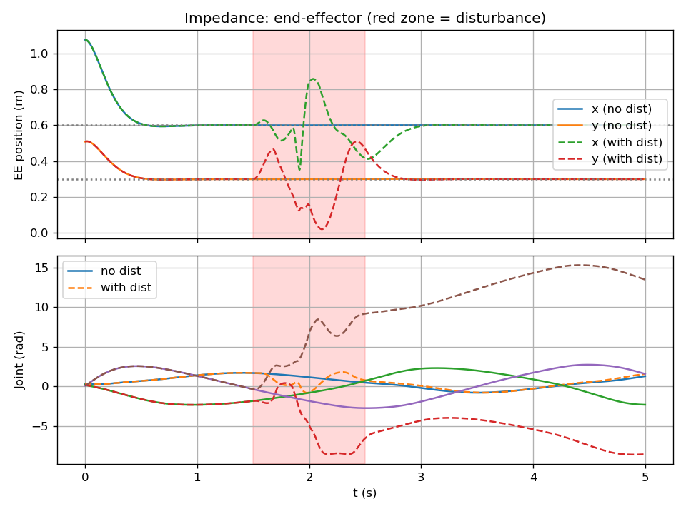

# 임피던스 제어 (Impedance Control)

작업공간(엔드이펙터 위치)에서 목표 위치 **x_d** 에 대해 **가상 스프링–댐퍼–질량** 관계를 부여하고, 그에 맞는 관절 토크 **τ** 를 계산한다.

---

## 왜 이 제어기를 쓰는가?

- **작업공간 제어**: 사람과 협업하거나 환경과 접촉할 때는 "관절각"보다 **엔드이펙터 위치·강성·댐핑**이 중요하다. 임피던스 제어는 목표 위치 $x_d$ 주변에서 **원하는 강성 $K_d$, 댐핑 $B_d$, 질량 $M_d$** 를 마치 가상 스프링·댐퍼·질량처럼 부여한다.
- **접촉 시**: 외력이 가해지면 EE가 밀려났다가, 스프링·댐퍼 특성에 따라 부드럽게 반응한다. 힘 제어가 아닌 **위치+임피던스** 로 동작해 구현이 상대적으로 단순하다.
- **구현 방식**: "원하는 EE 가속도" $\ddot{x}_{des}$ 를 임피던스 법칙으로 정한 뒤, 역기구학(가속도 수준)으로 $\ddot{q}_{des}$ 를 구하고, $\tau = M \ddot{q}_{des} + C + G$ 로 토크를 계산한다.

---

## 1. 수식 정리

### 작업공간 동역학 관계

- $x = f_{kin}(q)$: 정기구학 (엔드이펙터 위치)
- $\dot{x} = J(q) \dot{q}$, $\ddot{x} = J \ddot{q} + \dot{J} \dot{q}$ (자코비안 $J$)

### 임피던스 법칙 (가상 힘)

$$
F = M_d (\ddot{x}_d - \ddot{x}) + B_d (\dot{x}_d - \dot{x}) + K_d (x_d - x)
$$

$M_d$, $B_d$, $K_d$: 목표 질량·댐핑·강성 행렬(대각으로 설정).  
이 식은 "목표와 현재의 위치·속도·가속도 차이"에 스프링·댐퍼·질량을 곱한 **가상의 힘**을 정의한다.

### 구현 방식 (가속도 기반)

원하는 EE 가속도를

$$
\ddot{x}_{des} = \ddot{x}_d + M_d^{-1} \big[ B_d (\dot{x}_d - \dot{x}) + K_d (x_d - x) \big]
$$

로 두고, $\ddot{x}_{des} = J \ddot{q}_{des} + \dot{J} \dot{q}$ 에서

$$
\ddot{q}_{des} = J^{\dagger} (\ddot{x}_{des} - \dot{J} \dot{q})
$$

($J^{\dagger}$: 유사역행렬). 그 다음

$$
\tau = M(q) \ddot{q}_{des} + C(q,\dot{q}) + G(q)
$$

로 관절 토크를 계산한다.

---

## 2. 수식–코드 매칭

| 수식 | 코드 |
|------|------|
| $x = f_{kin}(q)$ | `dynamics.py`: `forward_kinematics(q)` |
| $\dot{x} = J \dot{q}$ | `run.py`: `xd = jacobian(q) @ qd` |
| $J(q)$ | `dynamics.py`: `jacobian(q)` (2×3) |
| $\dot{J}\dot{q}$ | `dynamics.py`: `jacobian_dot(q, qd)` |
| $\ddot{x}_{des} = \ddot{x}_d + M_d^{-1}[\cdots]$ | `run.py`: `xdd_des = XDD_D + np.linalg.solve(M_d, ...)` |
| $\ddot{q}_{des} = J^{\dagger}(\ddot{x}_{des} - \dot{J}\dot{q})$ | `run.py`: `qdd_des = J_pinv @ (xdd_des - J_dot @ qd)` |
| $\tau = M \ddot{q}_{des} + C + G$ | `run.py`: `tau = M(q) @ qdd_des + C_vec(...) + G(q)` |

---

## 3. 실행 방법

```bash
cd impedance
python run.py
```

---

## 4. 입·출력, 제약, 초기조건

| 구분 | 내용 |
|------|------|
| **입력** | 목표 EE 위치 $x_d$, 속도 $\dot{x}_d$, 가속도 $\ddot{x}_d$. 현재 $q$, $\dot{q}$. |
| **출력** | 관절 토크 $\tau \in \mathbb{R}^3$ |
| **제약** | 토크 제한 $\|\tau_i\| \le 50$ N·m |
| **초기조건** | $q(0) = [0.3, 0.2, 0.1]^T$, $\dot{q}(0) = 0$. 목표 $x_d = [0.6, 0.3]^T$ m. |

---

## 5. 외란 실험

$t \in [1.5,\,2.5]$ s 동안 $\tau_{dist} = [5,\,-2,\,1]^T$ N·m 를 가한다.  
외란 구간에서 EE 위치가 벗어났다가, **댐핑 $B_d$** 덕분에 다시 목표 근처로 수렴하는 것을 확인할 수 있다.

---

## 6. 결과


