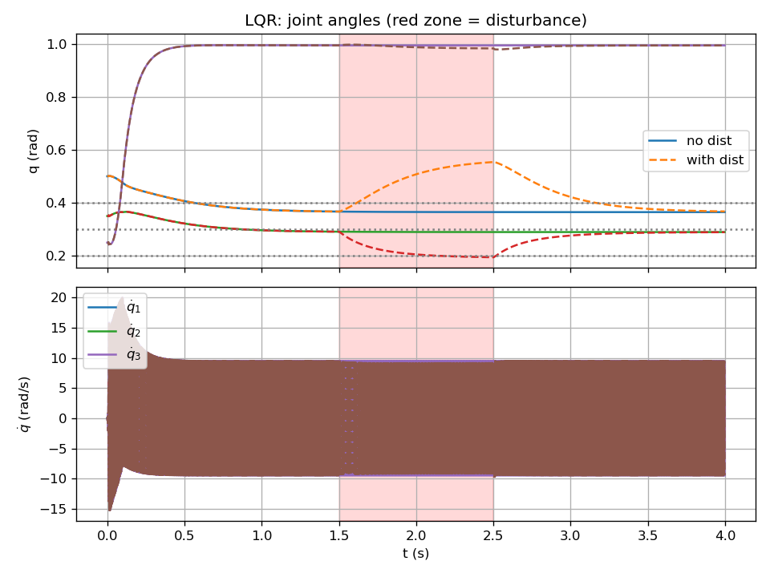

# LQR 제어 (Linear Quadratic Regulator)

평형점 $z_e = [q_e^T,\,0^T]^T$ ($\dot{q}_e = 0$) 주변에서 로봇 동역학을 **선형화**한 뒤, LQR로 이득 $K$ 를 구하고 $\tau = \tau_e - K(z - z_e)$ 를 적용한다.

---

## 왜 이 제어기를 쓰는가?

- **선형 제어의 이점**: 비선형 로봇을 한 평형점 근처에서 **선형 모델** $\dot{z} = A z + B u$ 로 근사하면, 이론이 잘 정립된 선형 제어(예: LQR)를 쓸 수 있다.
- **LQR의 의미**: 상태와 입력에 2차 비용(가중치 $Q$, $R$)을 두고, 비용을 최소화하는 **선형 상태 피드백** $u = -K(z - z_e)$ 를 구한다. 해는 **Riccati 방정식** 한 번 풀어서 얻으며, 계산이 가벼워 실시간에 적합하다.
- **적용 범위**: 평형점 **근처**에서만 선형 근사가 유효하므로, 초기 상태나 목표가 평형에서 너무 멀면 성능이 떨어질 수 있다. 이 실험에서는 평형 근처 초기조건을 사용한다.

---

## 1. 수식 정리

### 상태 및 평형

- $z = [q^T,\, \dot{q}^T]^T \in \mathbb{R}^6$, 평형 토크 $\tau_e = G(q_e)$
- 보조 입력 $u = \tau - \tau_e$ 로 두면 선형화 모델: $\dot{z} = A z + B u$

### Riccati 방정식 및 이득

$$
A^T P + P A - P B R^{-1} B^T P + Q = 0
$$

$$
K = R^{-1} B^T P, \qquad u = -K(z - z_e)
$$

$$
\tau = \tau_e + u = G(q_e) - K(z - z_e)
$$

$Q$: 상태 오차에 대한 가중치(큰 값이면 추종이 빨라짐), $R$: 입력 가중치(큰 값이면 토크를 절약하지만 반응이 느려짐).

### 선형화

$f(z,\tau) = [\dot{q}^T,\; (M^{-1}(\tau - C - G))^T]^T$ 에 대해

$$
A = \frac{\partial f}{\partial z} \bigg|_{(z_e,\tau_e)}, \qquad
B = \frac{\partial f}{\partial \tau} \bigg|_{(z_e,\tau_e)} = \begin{bmatrix} 0 \\ M^{-1}(q_e) \end{bmatrix}
$$

$A$, $B$ 는 수치 미분으로 구한다.

---

## 2. 수식–코드 매칭

| 수식 | 코드 |
|------|------|
| $A$, $B$ 선형화 | `dynamics.py`: `linearize(q_e)` |
| CARE $A^T P + PA - P B R^{-1} B^T P + Q = 0$ | `run.py`: `solve_care(A, B, Q, R)` (해밀토니안 고유벡터로 $P$ 계산) |
| $K = R^{-1} B^T P$ | `run.py`: `K_lqr = Rinv @ B.T @ P` |
| $u = -K(z - z_e)$ | `run.py`: `u = -K_lqr @ (z - Z_E)` |
| $\tau = \tau_e + u$ | `run.py`: `tau = TAU_E + u` |

---

## 3. 실행 방법

```bash
cd lqr
python run.py
```

---

## 4. 입·출력, 제약, 초기조건

| 구분 | 내용 |
|------|------|
| **입력** | 현재 상태 $z = [q^T,\, \dot{q}^T]^T$. 목표는 평형점 $z_e$ 로 고정. |
| **출력** | $\tau = \tau_e - K(z - z_e)$ |
| **제약** | 토크 제한 $\|\tau_i\| \le 50$ N·m. 선형화 평형 근처에서 유효. |
| **초기조건** | $q(0) = [0.5,\,0.35,\,0.25]^T$, $\dot{q}(0) = [0.1,\,0,\,0]^T$. 평형 $q_e = [0.4,\,0.3,\,0.2]^T$. |

---

## 5. 외란 실험

$t \in [1.5,\,2.5]$ s 동안 $\tau_{dist} = [5,\,-2,\,1]^T$ N·m.  
LQR가 외란에 대해 얼마나 빠르게 다시 평형으로 끌어들이는지 무외란 궤적과 비교할 수 있다.

---

## 6. 결과


