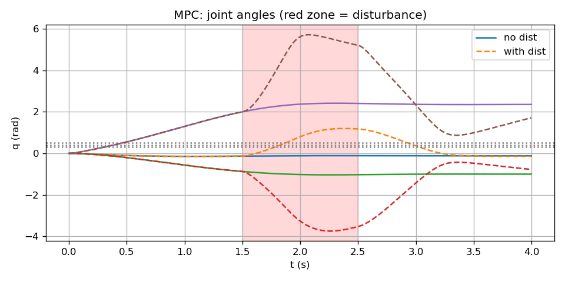

# MPC 제어 (Model Predictive Control)

선형화된 **이산시간** 모델로, 미래 $N$ 스텝 동안의 비용을 최소화하는 입력 열을 구한 뒤, **그중 첫 입력만** 적용하고 다음 스텝에서 다시 풀어나가는 **재ceding horizon** 방식을 쓴다. 여기서는 제약 없는 QP로 풀어 **numpy** 만 사용한다.

---

## 왜 이 제어기를 쓰는가?

- **미래를 고려한 제어**: 현재 입력만 결정하는 게 아니라, "앞으로 $N$ 스텝 동안 상태가 어떻게 변할지"를 모델로 예측하고, **그 궤적 전체**에 대한 비용(목표와의 차이 + 입력 크기)을 최소화한다. 그래서 한 스텝만 보는 제어보다 더 나은 궤적을 기대할 수 있다.
- **재ceding horizon**: 매 스텝마다 현재 상태를 기준으로 같은 최적화를 다시 푼다. 그래서 예측과 실제가 어긋나도(모델 오차, 외란) 다음 스텝에서 보정된다.
- **제약 추가 가능**: 나중에 토크 한계나 관절 한계를 부등식 제약으로 넣으면, 같은 MPC 틀 안에서 제약을 만족하는 입력을 구할 수 있다(이 예제는 제약 없는 QP만 구현).

---

## 1. 수식 정리

### 이산시간 모델

$$
z_{k+1} = A_d z_k + B_d u_k
$$

$z_k = [q^T,\, \dot{q}^T]^T$, $u_k = \tau_k - G(q_r)$. $A_d = I + A \Delta t$, $B_d = B \Delta t$ 로 이산화.

### 비용 함수

$$
J = \sum_{k=0}^{N-1} \left( \|z_k - z_r\|_Q^2 + \|u_k\|_R^2 \right) + \|z_N - z_r\|_{Q_N}^2
$$

$z_r$: 목표 상태. $Q$, $R$, $Q_N$ 으로 추종 강도와 입력 크기, 종단 가중치를 조절한다.

### 예측 궤적

$$
Z = \Phi z_0 + \Psi U, \quad Z = [z_1^T,\, \ldots,\, z_N^T]^T, \quad U = [u_0^T,\, \ldots,\, u_{N-1}^T]^T
$$

$\Phi$, $\Psi$ 는 $A_d$, $B_d$ 로부터 구성한다.

### QP 형태

$$
\min_U \ \frac{1}{2} U^T H U + c^T U, \quad H = 2(\Psi^T \bar{Q} \Psi + \bar{R}), \quad c = 2 \Psi^T \bar{Q} (\Phi z_0 - Z_{ref})
$$

$\bar{Q} = \mathrm{blkdiag}(Q,\ldots,Q,Q_N)$, $\bar{R} = \mathrm{blkdiag}(R,\ldots,R)$.  
해: $U^* = -H^{-1} c$. **적용하는 것은 첫 입력만**: $\tau = G(q_r) + u_0^*$.

---

## 2. 수식–코드 매칭

| 수식 | 코드 |
|------|------|
| $A_d$, $B_d$ 이산화 | `run.py`: `A_d = np.eye(6) + A * DT_MPC`, `B_d = B * DT_MPC` |
| $\Psi$ (예측 입력 행렬) | `run.py`: `build_psi(Ad, Bd, N)` |
| $\Phi$ | `run.py`: `build_phi(Ad, N)` |
| $\bar{Q}$, $\bar{R}$ | `run.py`: `Q_bar`, `R_bar` |
| $H$, $c$, $U^* = -H^{-1}c$ | `run.py`: `H = 2*(...)`, `c = 2*Psi.T @ ...`, `U = np.linalg.solve(H, -c)` |
| $\tau = G(q_r) + u_0^*$ | `run.py`: `tau = G(Q_REF) + u0` |

---

## 3. 실행 방법

```bash
cd mpc
python run.py
```

---

## 4. 입·출력, 제약, 초기조건

| 구분 | 내용 |
|------|------|
| **입력** | 현재 상태 $z$. 목표 $z_r$ (상수). |
| **출력** | $\tau = G(q_r) + u_0^*$ (매 스텝 QP 해의 첫 입력만 적용) |
| **제약** | 제약 없는 QP. 토크 사후 클리핑 $\|\tau_i\| \le 50$ N·m. |
| **초기조건** | $q(0) = [0,0,0]^T$, $\dot{q}(0) = 0$. 목표 $q_r = [0.5,\,0.4,\,0.3]^T$. |

---

## 5. 외란 실험

$t \in [1.5,\,2.5]$ s 동안 $\tau_{dist} = [5,\,-2,\,1]^T$ N·m.  
재ceding horizon 때문에 매 스텝 새로 풀어서, 외란에 대한 보정이 계속 이루어지는 것을 볼 수 있다.

---

## 6. 결과


