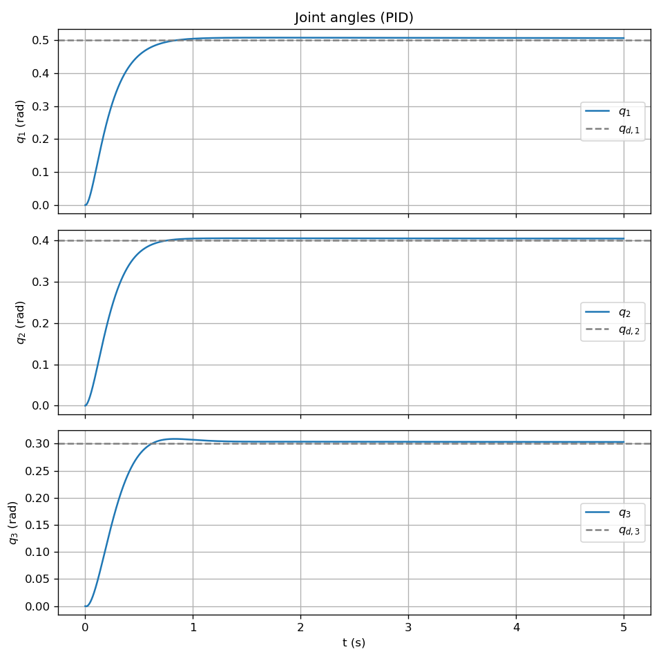

# 동역학 기반 PID 제어 (Computed Torque)

3-DOF 평면 로봇 팔에 **Computed Torque** 방식의 PID를 적용한 예제입니다.  
목표 관절각과의 **오차**를 PID로 보정해 “원하는 가속도”를 정하고, 로봇 **동역학 식**을 이용해 그 가속도를 만들기 위한 **토크**를 계산합니다.

---

## 이 제어기를 쓰는 이유

- **일반 PID의 한계**: 관절마다 $\tau = K_p e + K_d \dot{e}$ 만 쓰면, 로봇의 **비선형·결합** 동역학 때문에 한 관절 움직임이 다른 관절에 영향을 주어 성능이 나빠질 수 있습니다.
- **Computed Torque 아이디어**: 먼저 **원하는 가속도** $u$를 PID로 정한 뒤, “그 가속도를 만들려면 어떤 토크가 필요한가?”를 **동역학**으로 계산합니다. 이렇게 하면 동역학이 보상되어, 각 관절이 설계한 대로 움직이게 할 수 있습니다.
- **적분항(Ki)**: 일정한 외란이나 모델 오차로 인한 **정상상태 오차**를 줄이기 위해, 오차의 **적분**을 넣습니다.

---

## 1. 수식 정리

### 로봇 동역학

$$
M(q)\,\ddot{q} + C(q,\dot{q}) + G(q) = \tau
$$

- $q$: 관절각 (3차원 벡터)  
- $M(q)$: 관성 행렬 (3×3, 대칭·양정치)  
- $C(q,\dot{q})$: 코리올리스·원심력 벡터  
- $G(q)$: 중력 벡터  
- $\tau$: 관절 토크  

### 제어 법칙 (동역학 기반 PID)

목표 $q_d$, $\dot{q}_d$, $\ddot{q}_d$ 와 현재 $q$, $\dot{q}$ 의 오차를 이용합니다.

$$
e = q_d - q, \qquad \dot{e} = \dot{q}_d - \dot{q}
$$

**원하는 가속도** $u$를 PID로 정합니다.

$$
u = \ddot{q}_d + K_p\, e + K_d\, \dot{e} + K_i \int e \, dt
$$

이 $u$를 만들기 위한 **토크**는 동역학을 이용해 다음처럼 계산합니다.

$$
\tau = M(q)\, u + C(q,\dot{q}) + G(q)
$$

이렇게 하면 이론적으로 폐루프에서 $\ddot{q} \approx u$ 가 되므로, $u$를 PID로 설계한 대로 추종·안정성이 얻어집니다.

---

## 2. 수식–코드 매칭

| 수식 | 코드 위치 |
|------|-----------|
| $M(q)$ | `dynamics.py`: `M(q)` |
| $C(q,\dot{q})$ | `dynamics.py`: `C_vec(q, qd)` |
| $G(q)$ | `dynamics.py`: `G(q)` |
| $e = q_d - q$ | `run.py`: `e = Q_D - q` |
| $\dot{e} = \dot{q}_d - \dot{q}$ | `run.py`: `edot = QD_D - qd` |
| $\int e \, dt$ | `run.py`: `e_int += e * DT` |
| $u = \ddot{q}_d + K_p e + K_d \dot{e} + K_i \int e$ | `run.py`: `u = QDD_D + Kp@e + Kd@edot + Ki@e_int` |
| $\tau = M u + C + G$ | `run.py`: `tau = M(q)@u + C_vec(q,qd) + G(q)` |
| $\ddot{q} = M^{-1}(\tau - C - G)$ | `dynamics.py`: `qdd_from_tau()` → RK4 적분 |

---

## 3. 실행 방법

```bash
cd pid
python run.py
```

필요 패키지: `numpy`, `matplotlib`

---

## 4. 입·출력, 제약, 초기조건

| 구분 | 내용 |
|------|------|
| **입력** | 목표 관절각 $q_d$, 속도 $\dot{q}_d$, 가속도 $\ddot{q}_d$. 현재 상태 $q$, $\dot{q}$. |
| **출력** | 관절 토크 $\tau \in \mathbb{R}^3$ |
| **제약** | 토크 제한 $\|\tau_i\| \le 50$ N·m. 적분 오차 클리핑 $[-2,\,2]$. |
| **초기조건** | $q(0)=[0,0,0]^T$, $\dot{q}(0)=0$. 목표 $q_d=[0.5,\,0.4,\,0.3]^T$. |

---

## 5. 외란 실험

$t \in [1.5,\,2.5]$ 초 구간에서 관절 토크에 상수 외란 $\tau_{dist} = [5,\,-2,\,1]^T$ N·m 를 더해 줍니다.

외란 구간에서 오차가 잠시 커졌다가, **적분항** 때문에 다시 목표로 수렴하는 모습을 확인할 수 있습니다.

---

## 6. 결과

`run.py` 실행 시 `pid_result.png` 가 생성됩니다.

- 실선: 외란 없음  
- 점선: 외란 있음  
- 붉은 영역: 외란 구간  


