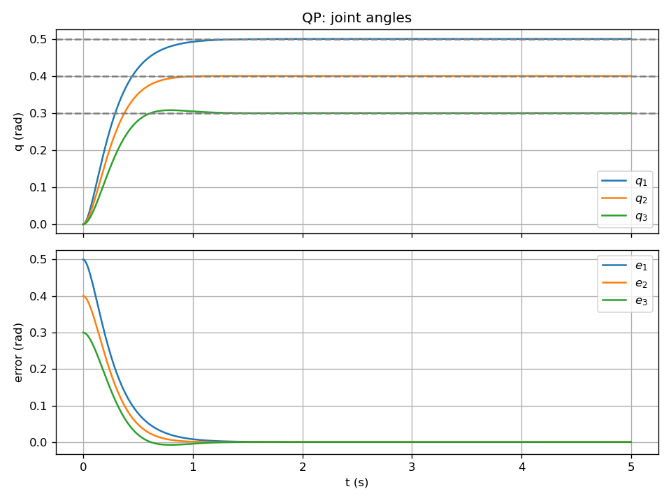

# QP 제어 (목표 각도 추종)

목표 관절각 $q_d$ 를 추종하기 위해, 매 스텝에서 **원하는 가속도** $a$ 를 **2차 계획(QP)** 으로 정하고, 동역학을 이용해 $\tau = M(q)\,a + C + G$ 로 토크를 계산하는 예제입니다.  
여기서는 **제약 없는 QP**에 정규화만 넣어 구현합니다.

---

## 이 제어기를 쓰는 이유

- **PD형 목표 가속도**: “이상적인 가속도”를 먼저 PD 형태로 정의합니다. $a$ 를 그대로 쓰면 PD 제어와 비슷하게 동작합니다.
- **QP로 정하는 이유**: 나중에 **토크 한계** $\tau_{min} \le \tau \le \tau_{max}$ 나 **가속도 한계** 같은 **선형 제약**을 넣고 싶을 때, “가능한 $a$ 중에서 그 목표에 가장 가까운 것”을 고르는 문제가 **2차 계획(QP)** 이 됩니다. 지금은 제약 없이 **정규화** $\lambda\,\|a\|^2$ 만 넣어 QP 형태로 풀어 두었습니다.
- **정규화 $\lambda$**: $\lambda$ 를 크게 하면 $a$ 가 작아져 토크가 부드러워지고, 작게 하면 목표 가속도에 가깝게 따라가 추종이 빨라집니다.

---

## 1. 수식 정리

### 목표 가속도 (PD형)

오차 $e = q_d - q$, $\dot{e} = \dot{q}_d - \dot{q}$ 로 두고, “이상적인” 가속도를 다음처럼 둡니다.

$$
b = \ddot{q}_d + K_p\,(q_d - q) + K_d\,(\dot{q}_d - \dot{q})
$$

### QP (정규화 포함)

$b$ 에 가깝되, $a$ 가 너무 커지지 않도록 정규화를 넣은 2차 계획입니다.

$$
\min_a \ \frac{1}{2}\,\|b - a\|^2 + \frac{\lambda}{2}\,\|a\|^2
$$

전개하면 $\frac{1}{2}\,a^T(I + \lambda I)\,a + (-b)^T a$ + 상수 이므로, $H = (1+\lambda)I$, $c = -b$ 인 QP가 됩니다.

### 해와 토크

제약이 없을 때 해는 다음과 같습니다.

$$
a^* = (1+\lambda)^{-1}\, b
$$

이 가속도를 만들기 위한 토크는 동역학으로 계산합니다.

$$
\tau = M(q)\, a^* + C(q,\dot{q}) + G(q)
$$

---

## 2. 수식–코드 매칭

| 수식 | 코드 |
|------|------|
| $b = \ddot{q}_d + K_p\,e + K_d\,\dot{e}$ | `run.py`: `b = QDD_D + Kp @ e + Kd @ edot` |
| $H = (1+\lambda)I$, $c = -b$ | `run.py`: `H_qp = (1.0 + lam) * np.eye(3)`, `c_qp = -b` |
| $a^* = H^{-1}(-c)$ | `run.py`: `a_star = np.linalg.solve(H_qp, -c_qp)` |
| $\tau = M\,a^* + C + G$ | `run.py`: `tau = M(q) @ a_star + C_vec(...) + G(q)` |

---

## 3. 실행 방법

```bash
cd qp
python run.py
```

---

## 4. 입·출력, 제약, 초기조건

| 구분 | 내용 |
|------|------|
| **입력** | 목표 $q_d$, $\dot{q}_d$, $\ddot{q}_d$. 현재 $q$, $\dot{q}$. |
| **출력** | $\tau = M\,a^* + C + G$ |
| **제약** | 제약 없는 QP. 토크 클리핑 $\|\tau_i\| \le 50$ N·m. |
| **초기조건** | $q(0)=[0,0,0]^T$, $\dot{q}(0)=0$. 목표 $q_d=[0.5,\,0.4,\,0.3]^T$. |

---

## 5. 외란 실험

$t \in [1.5,\,2.5]$ 초 동안 $\tau_{dist} = [5,\,-2,\,1]^T$ N·m 를 가합니다.

QP 제어기의 외란 억제 특성을 무외란 궤적과 비교할 수 있습니다.

---

## 6. 결과


